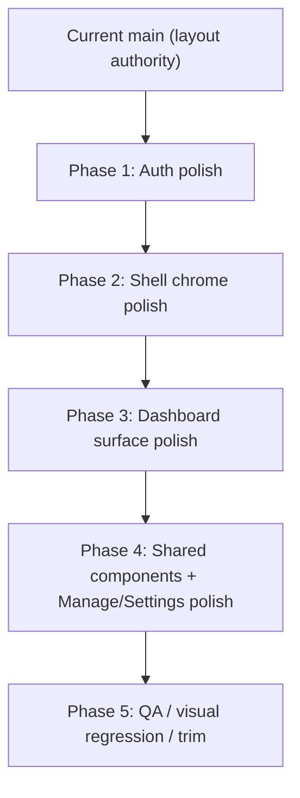

# React Hybrid Alignment Plan, Phased

## Summary
Baseline is the current post-rollback `main`:
- Login is a simple single-column auth screen with inline styles.
- The authenticated shell is the simpler React structure: compact `FFB` brand, top nav with `Dashboard / Manage / Settings`, direct dashboard status card, direct `SettlementBoard`, simple Manage tabs, simple Settings placeholder.
- This simpler React structure is the layout authority. Legacy JS is only a visual reference.

## Visual Freeze Map


| Area | Must stay frozen | Can change |
|---|---|---|
| Brand / nav | `FFB`, nav order, link destinations, top-row structure | color, shadows, spacing, hover/active treatment |
| Dashboard | year/status row, lifecycle row, KPI row, progress row, `SettlementBoard` directly below | card finish, badge styling, KPI treatment, spacing |
| Manage | top tabs directly above content | tab styling, spacing, card surfaces below |
| Settings | `BillingYearSelector` followed by one placeholder card | surface styling, spacing, type |
| Auth | login/signup/forgot/google flows and form structure | full visual redesign, but no behavior changes |

### Scope-Creep Rule
A change is out of phase if it does any of the following:
- adds a new header band, hero wrapper, or extra top-level container to authenticated routes
- changes brand copy from `FFB` without explicit approval
- changes nav/tab order, route targets, or route structure
- introduces new product copy blocks above existing authenticated content
- moves a page from “single card + content” to “hero + workspace” composition

## Phase 0: Freeze and Reference
### Goal
Lock the current React structure as the implementation baseline before any new styling work starts.

### Changes
- Capture desktop and mobile screenshots for `login`, `dashboard`, `manage/members`, and `settings`.
- Create a short “structure contract” doc listing the frozen layout points from the table above.
- Split style work into scoped CSS files from the start so no single `shell.css` override block grows uncontrolled.

### Visual
```text
AUTHENTICATED SHELL (frozen)
[FFB] [Dashboard] [Manage] [Settings]                [email] [Sign Out]

DASHBOARD (frozen)
[ Billing Year | Status ]
[ Lifecycle ]
[ KPI | KPI | KPI | KPI ]
[ Progress ]
[ Settlement Board ]
```

### Stop If
- anyone proposes extra wrappers above `SettlementBoard`
- anyone proposes replacing `FFB` with full product title in nav
- anyone proposes a second tab/header row on dashboard

## Phase 1: Auth Polish Only
### Goal
Make `/login` feel polished and legacy-inspired without touching the authenticated app.

### Changes
- Replace inline auth styling with class-based styling in `LoginView`.
- Implement a two-panel desktop auth layout and stacked mobile layout.
- Add a branded hero, trust copy, supporting proof points, elevated auth card, clearer error/success states, rounded inputs, and polished Google CTA.
- Preserve current auth behavior, field order, copy intent, and route behavior.

### Allowed Visual Delta
```text
Before
[ title ]
[ form ]
[ divider ]
[ google ]

After
[ branded hero ]   [ auth card ]
[ proof points ]   [ same form logic ]
```

### Explicitly Not In Scope
- nav bar
- dashboard
- manage/settings
- auth logic changes
- route or redirect changes

### Acceptance Criteria
- login/signup/forgot/google flows behave exactly as today
- no inline presentation remains in auth view
- desktop and mobile auth screenshots are approved before Phase 2 starts

## Phase 2: Shell Chrome Only
### Goal
Polish the authenticated shell while keeping the exact current layout skeleton.

### Changes
- Restyle the app canvas/background, nav bar, nav links, email/sign-out controls, and spacing around `main`.
- Keep `FFB`, current link order, and current single-row shell.
- Use subtler polish than the reverted attempt: soft elevation, restrained tinting, mild gradients, clearer active state, better spacing rhythm.
- Scope background treatment to `.app-shell` only so login and public surfaces do not inherit it.

### Visual
```text
Frozen structure:
[FFB][Dashboard][Manage][Settings]........[email][Sign Out]

Phase 2 only changes:
- background
- paddings
- borders
- active/hover states
- shadow/elevation
```

### Stop If
- brand text changes
- link targets change
- nav becomes pill-group or secondary header
- new kicker/subtitle is added to the nav brand block

## Phase 3: Dashboard Surface Polish
### Goal
Upgrade the dashboard’s finish while preserving the current component tree and reading order.

### Changes
- Keep the existing `dashboard-hero` composition: metadata row, lifecycle, KPIs, progress, hint.
- Improve only surface quality: badge styling, KPI cards, progress treatment, card elevation, internal spacing, empty/loading states.
- Restyle `SettlementBoard` cards, filters, badges, and action emphasis to match the dashboard polish.
- Do not add a new intro headline block, new workspace wrapper, or new explanatory header above `SettlementBoard`.

### Visual
```text
Frozen:
[ Year + Status ]
[ Lifecycle ]
[ KPI row ]
[ Progress ]
[ Settlement Board ]

Editable:
[Pill style]
[KPI card finish]
[Progress bar]
[Row card styling]
```

### Acceptance Criteria
- DOM hierarchy stays materially the same as current `main`
- `SettlementBoard` remains directly below the dashboard card
- all existing dialogs/actions still open from the same places

## Phase 4: Shared Components, Manage, and Settings
### Goal
Extend the same polished finish to the rest of the authenticated app without structural invention.

### Changes
- Polish shared primitives: cards, dialogs, buttons, chips, filters, form controls, action menus, empty states.
- Keep Manage exactly as “tabs then content”; only update tab styling and downstream panel/card styling.
- Keep Settings exactly as “billing year selector then placeholder card”; only update spacing, type, and surfaces.
- Do not reintroduce a shared page-header component unless it is purely internal to a card and does not create a new route-level layout tier.

### Visual
```text
MANAGE (frozen)
[ Members | Bills | Invoicing | Review Requests ]
[ active tab content ]

SETTINGS (frozen)
[ BillingYearSelector ]
[ Additional Settings placeholder ]
```

### Stop If
- a top-level route gets a new page-intro block
- Manage becomes “header + tabs + content”
- Settings becomes a two-column redesign without explicit approval

## Phase 5: QA, Diff Review, and Scope Control
### Goal
Prevent another visual drift cycle before merge.

### Changes
- Add/update React tests only where structure or selectors materially change.
- Do side-by-side desktop and mobile visual review against:
  - current React baseline screenshots from Phase 0
  - legacy JS screenshots used only for finish/tone comparison
- Use a short review checklist on every PR:
  - structure unchanged?
  - brand/nav unchanged?
  - route/page hierarchy unchanged?
  - only visual finish improved?

### Test Plan
- Auth: login, signup, forgot-password, Google sign-in, loading, error, success
- Dashboard: loading, no year, no members, open, settling, ready-to-close, closed, archived
- Manage: each tab renders, active-tab state unchanged
- Settings: selector and placeholder still render in same order
- Regression: route redirects, sign-out visibility, clickable KPI behavior, dialogs from `SettlementBoard`

## Public APIs / Interfaces
- No route, auth, billing, Firestore, or share-link API changes
- No public component contract changes required
- Internal additions allowed only for CSS modules/classes and small presentational helpers that do not alter route-level structure

## Assumptions and Defaults
- Current `main` after rollback is the correct structural baseline.
- Legacy JS influences polish, not page composition.
- `FFB` stays in the nav unless separately approved.
- Any request that changes route-level composition becomes a new scoped phase, not part of this plan by default.
